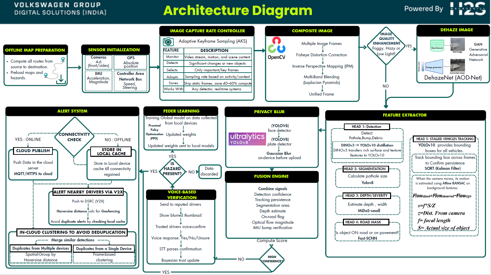
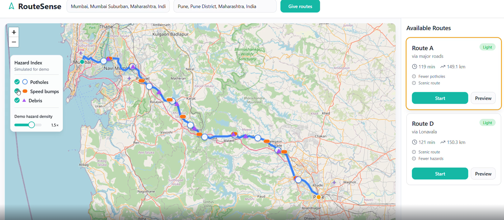
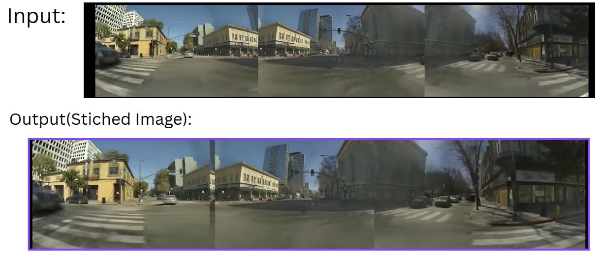
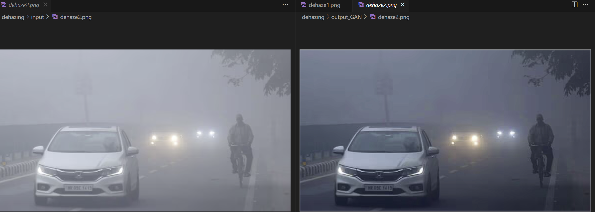
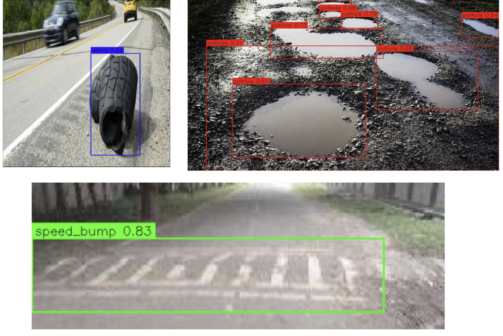
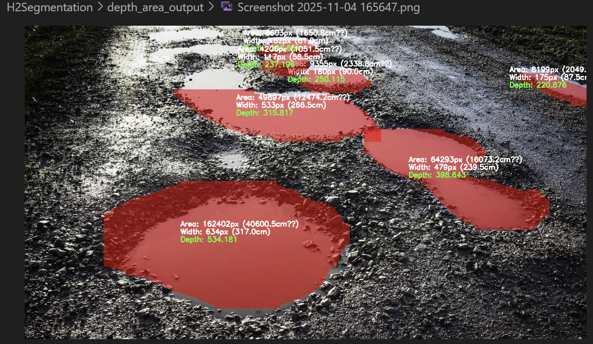
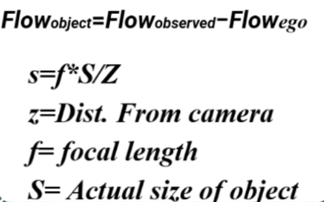

# 🚗 Volkswagen Intelligent Hazard Detection System

### 📘 Overview
AI-driven hazard detection and feedback learning system for smart vehicles.  
Integrates **computer vision**, **sensor fusion**, and **edge–cloud intelligence** to detect and alert drivers about potholes, bumps, debris, or stalled vehicles.

---

## 🧠 1️⃣ Architecture Overview

🎥 Demo Video:  
<video width="640" controls>
  <source src="./videos/Volkswagen_Quisk.mp4" type="video/mp4">
</video>

---

## 🗺️ 2️⃣ Offline Map Preparation

🎯 **Objective:**  
Enable safe and optimized navigation by combining **real-time** and **offline hazard-aware routing**.

⚙️ **Key Highlights:**  
- **Start–End Input:** Driver selects source and destination (works online & offline).  
- **Smart Route Fetching:** Fetches the safest & most efficient route using preloaded hazard data.  
- **Hazard Overlay:** Displays potholes, bumps, and debris along the route using YOLO-based detection.  
- **Voice Alerts:** Real-time voice guidance warns the driver of upcoming hazards.  
- **Offline Mode:** Operates seamlessly with pre-fetched routes and hazard cache.  
- **Hazard Density Slider:** Allows users to simulate or adjust hazard visibility on the map.  

---

## 🚗 3️⃣ Image Capture Rate Controller (AKS)

🎯 **Objective:**  
Optimize video processing by capturing only key frames through **Adaptive Keyframe Sampling (AKS)**.

🔍 **Overview:**  
- Monitors video stream, motion, and scene content in real time.  
- Skips redundant frames when the car is static or moving slowly.  
- Captures more frames during rapid motion or new object appearance.  
- Processes **only keyframes** to maintain efficiency without losing critical details.  

⚙️ **Impact:**  
Reduces compute load and latency by **up to 60%**, while preserving essential scene information.

📊 **Performance Summary**

| Scenario | Avg Speed | Keyframes Saved | Behavior |
|-----------|------------|------------------|-----------|
| 🚦 City / Traffic | 0.18 km/h | 20.08% | Slow → Frames skipped |
| 🛣️ Highway | 13.07 km/h | 23.82% | Fast → More frames saved |

🎥 **Demo:**  
<iframe src="https://drive.google.com/file/d/1XoV6hV5G-eiYsWmdHrJb4z8seiDvawzX/preview" 
        width="720" height="480" allow="autoplay">
</iframe>

---

## 🧩 4️⃣ Composite Image Generation

Combines multiple camera feeds into a **single unified frame** using OpenCV.

🧠 **Pipeline**
1. **Multiple Image Frames** → Input from different cameras  
2. **Fisheye Distortion Correction** → Removes lens curvature and fixes 180°+ distortion  
3. **Inverse Perspective Mapping (IPM)** → Aligns ground plane and maintains consistent scale  
4. **Multi-Band Blending (Laplacian Pyramids)** → Seamless merging, removes seams  
5. **Unified Frame** → Final panoramic composite  

---

## 🧩 5️⃣ Image Quality Enhancement (DehazeNet)

Enhances **foggy, hazy, or low-light** frames using a **lightweight GAN-based AOD-Net** to restore clarity and boost detection accuracy.

**Key Points:**
- 5-layer CNN with skip connections  
- Fast, CPU-friendly, deployable on mobile  
- Formula: `clean = ReLU((x5 * x) - x5 + 1)`  
- Input → RGB image | Output → Dehazed RGB image  

🎯 **Goal:** Restore clear visuals for reliable vision-based detection.

🖼️ Before vs After Dehazing:  

---

## 🧩 6️⃣ Feature Extractor
The **Feature Extractor** is the vision intelligence core of the system.  
It performs **multi-head visual analysis** to detect, segment, measure, and track road hazards with ego-motion compensation.

| Head | Task | Model |
|------|------|--------|
| 1 | Object Detection (Pothole, Bump, Debris) | YOLOv10 + DINOv3 Distillation |
| 2 | Segmentation (Pothole Size Estimation) | YOLOv8 (self-trained) |
| 3 | Depth & Severity Estimation | MiDaS-small |
| 4 | Road Mask (On-road or Pavement) | Fast-SCNN |
| 5 | Stalled Vehicle Tracking | YOLOv10 + SORT (Kalman Filter) + Affine RANSAC |

---

### 🧩 Head 1: Detection
- Detects **potholes, bumps, and debris** using **YOLOv10**.
- Enhanced via **DINOv3 → YOLOv10 distillation**, transferring texture-rich features for better accuracy.
- Provides base bounding boxes for later modules.

---

### 🧩 Head 2: Segmentation

🎯 **Goal**  
Detect and segment **pothole regions** using a **YOLOv8-Segmentation** model to obtain **pixel-level masks** that quantify the damaged road surface area.

**Model Summary**

| Parameter | Description |
|------------|--------------|
| **Input** | 640×640 RGB road image |
| **Output** | Bounding box + Mask for each detected pothole |
| **Model File** | `YoloV8Segmented.pt` |

🧮 **Formula**  
`Pothole Area = Σ(mask_pixels) × (pixel_scale)^2`

📊 **Performance Metrics**

| Metric | Value |
|---------|--------|
| Precision | 0.76 |
| Recall | 0.59 |
| mAP50 | 0.72 |
| mAP50–95 | 0.45 |
| Fitness | 0.878 |

---

### 🧩 Head 3: Depth & Severity Estimation

**Overview**  
Estimates the **depth**, **width**, and **area** of detected potholes using **MiDaS v2.1 Small**.  
Each pothole is then classified as **Minor**, **Moderate**, or **Severe** based on **depth–area thresholds**.

**Workflow**
1. Take **segmented pothole masks** from YOLOv8-Segmentation output.  
2. Generate a **relative depth map** using **MiDaS-small (256)**.  
3. Compute:
   - **Area** → from mask pixels  
   - **Width / Height** → from bounding box  
   - **Depth** → mean depth in masked region  
4. Combine **depth and area** to classify severity.  

🧮 **Formula for Apparent Size**
`S = f * X / Z`

**Where:**
- f = focal length  
- X = observed pixel width  
- Z = distance from camera  

🖼️ **Output Example**  

---

### 🧩 Head 4: Road Mask

🎯 **Goal**  
Determine whether each detected object lies **on the drivable surface** or **off-road/pavement**.  
Helps filter false hazards and improves safety analytics.

⚙️ **Architecture Overview**

| Head | Purpose | Model Used | Input | Output |
|------|----------|-------------|--------|---------|
| 1 | Road Segmentation | 🧩 Fast-SCNN (Cityscapes-trained) | RGB image | Binary road mask |
| 2 | Pothole Masking | 🎯 YOLOv8-Seg (custom-trained) | RGB image | Pothole masks |
| 3 | Vehicle Segmentation | 🚗 YOLOv11n-Seg (COCO-pretrained) | RGB image | Vehicle masks |

🧮 **Computation**
`on_road_ratio = overlap_area / object_area`

🖼️ **Example Output**  

---

### 🧩 Head 5: Stalled Vehicles Tracking
- Detects and tracks **stalled vehicles** using **YOLOv10 + SORT (Kalman Filter)**.  
- Compensates for **camera motion** using **Affine RANSAC** on background features.

🧮 **Ego-Motion Compensation Formula:**

🎥 **Demo:**  
<iframe src="https://drive.google.com/file/d/1Lp4UQRNKpWlADlHd_ZKrdra-lUGOxaDZ/preview" 
        width="720" height="480" allow="autoplay">
</iframe>

---

## ✅ 7️⃣ Fusion Engine

🎯 **Goal**  
Fuse outputs from all perception heads into one reliable **confidence score (C_final)** for final hazard decision.

⚙️ **Workflow**
1. Collect outputs from all heads.  
2. Compute individual confidence scores.  
3. Apply **fusion rules** — Weighted, Multiplicative, or Rule-Based.  
4. Generate final **C_final** for verification and alert modules.

🧮 **Individual Confidence Scores**

| Head | Metric | Formula |
|------|---------|----------|
| Detection | Class × IoU | `C_detect = P_class × IoU` |
| Segmentation | Mask ratio | `C_seg = Area_mask / Area_bbox` |
| Depth | Error decay | `exp(-depth_error / σ)` |
| Road | On-road penalty | `C_road = {1.0 if on_road, α if off_road}` |
| Tracking | Persistence | `C_track = min(track_age / T_stable, 1) × (1 - miss_rate)` |

---

## 🔒 8️⃣ Privacy Blur

🎯 **Goal**  
Blur faces and license plates **on-device** before upload using **YOLOv8 + Gaussian Blur**.

⚙️ **Workflow**
1. Frame input from Fusion Engine.  
2. Detect faces & plates using YOLOv8.  
3. Apply Gaussian blur using OpenCV.  
4. Forward anonymized output downstream.

🖼️ **Results**

| Face Blur | Number Plate Blur |
|------------|------------------|
|  |  |

---

## 🗣️ 9️⃣ Voice-Based Verification

🎯 **Goal**  
Validate detected hazards through **trusted driver voice feedback** using a **GenAI verification interface**.

⚙️ **Workflow**
1. Send hazard clip to trusted driver.  
2. Collect **Yes / No / Unsure** response.  
3. Apply **Speech-to-Text** + Bayesian trust update.  
4. Confirmed hazards are uploaded; rejected ones discarded.

🧮 **Confidence Adjustment**
`C_verified = C_final × β`  
(`β = 1.2` if verified, `0.5` if unverified)

🧮 **Trust Update**
`Trust_new = Trust_prev + η × (Verification_result - Expected)`

🎥 **Demo:**  
<iframe src="https://drive.google.com/file/d/1vjpDZbSEpLwrKn-KVpwRr5L3FaaPR5wL/preview" 
        width="720" height="480" allow="autoplay">
</iframe>

---

## 🧠 🔟 Feedback Learning (Federated PPO)

🎯 **Goal / Motto**  
“Every vehicle learns — the fleet gets smarter.”  
Uses **federated PPO learning** to improve detection without sharing raw data.

⚙️ **Process**
1. Vehicles train locally.  
2. Send model updates (not data) to server.  
3. Server aggregates via PPO.  
4. Global model redistributed → continuous improvement.

---

## ⚡ 1️⃣1️⃣ Alert System

🎯 **Goal**
Ensure reliable, **non-redundant hazard uploads** from drivers to the server — even offline.

⚙️ **Workflow**
1. **Connectivity Check**
   - ✅ Internet → Send via **MQTT**  
   - ❌ Offline → Store in local cache
2. **Server Receives Data**
   - MQTT topic `/hazard/detections`
3. **Clustering (Haversine Formula)**
   - Merge nearby hazards to prevent duplicates.

🧮 **Formula**
`d = 2R × arcsin(√a)`  
`a = sin²(Δlat/2) + cos(lat₁) × cos(lat₂) × sin²(Δlon/2)`

---

## 🧩 1️⃣2️⃣ Tech Stack

### 🤖 **AI / ML Frameworks**
- **YOLOv10 / YOLOv11** → Object detection for potholes, debris, stalled vehicles  
- **YOLOv8-Seg** → Pixel-level segmentation for pothole shape & area estimation  
- **MiDaS-small v2.1** → Depth & severity estimation  
- **Fast-SCNN** → Lightweight road mask segmentation (drivable area classification)  
- **DINOv3 Distillation** → Feature-rich representation transfer to YOLOv10  
- **PPO (Proximal Policy Optimization)** → Federated feedback learning algorithm  
- **AOD-Net / DehazeNet** → Low-light & haze restoration for image clarity  
- **SORT / StrongSORT** → Object tracking with Kalman Filter + IoU Matching  

---

### ☁️ **Cloud & Communication**
- **MQTT / HTTPS** → Data transfer between vehicle → cloud → app  
- **V2X Communication (DSRC / MQTT Topics)** → Peer-to-peer vehicle alerts  
- **Haversine Clustering** → In-server deduplication of hazard reports  

---

### 🔒 **Security & Privacy**
- **YOLOv8 Face + Plate Detector** → Privacy blur before upload  
- **SSL / TLS** → Secure data transmission  
- **Tokenized Session Handling** → Avoids redundant hazard submissions  

---

### 🧭 **Mapping & Navigation**
- **OSM (OpenStreetMap) APIs** → Map rendering & hazard overlay  
- **Leaflet.js / Mapbox** → Real-time road visualization  
- **Offline Tile Caching** → Hazard-aware route navigation when offline  

---

🧠 **Summary:**  
The pipeline spans **edge AI, federated learning, and cloud analytics**, ensuring reliability, privacy, and real-time hazard awareness from detection → verification → alert dissemination.

---

## 📂 1️⃣3️⃣ Project Structure

---

##  Impact
> Enhances road safety by detecting and verifying real-world hazards in real time — even in fog, low-light, or offline conditions.
